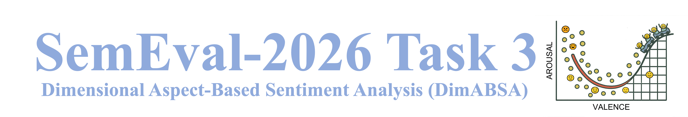
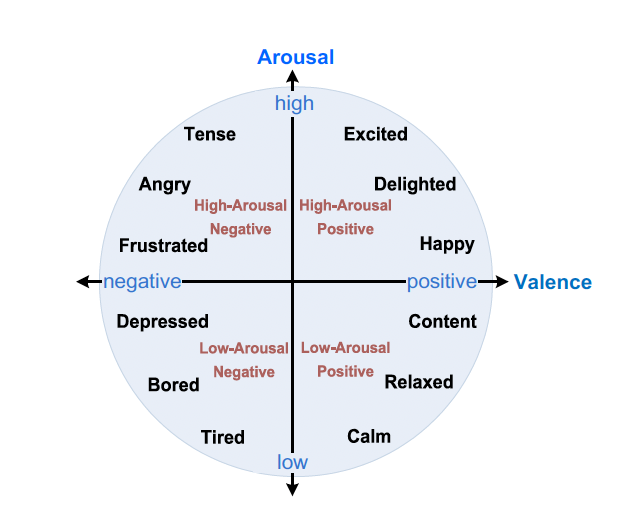
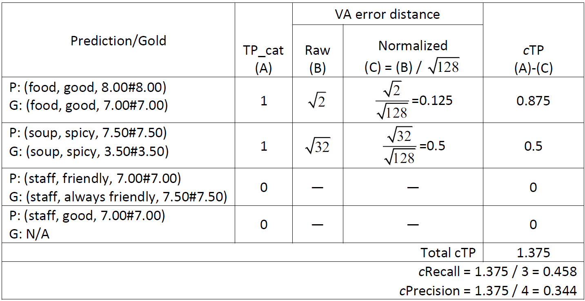

<!--<figure>
  
</figure>-->
<figure>
  
</figure>

# Content
<!--
- [📢 **News**](#-news)

    - [**11 November 2025**](#11-November-2025)
    - [**5 November 2025**](#5-November-2025)
    - [**11 October 2025**](#11-october-2025)
-->
- [Overview](#overview)
- [Task Description](#task-description)
    - [Track A: DimABSA](#track-a-dimabsa) 
    - [Track B: DimStance](#track-b-dimstance)
-  [Dataset](#Datasets)
- [Evaluation](#evaluation)
-  [Starter Kit](#starter-kit)
- [Full List of Aspect Categories](#full-list-of-aspect-categories)
- [Important Dates and Task Phases](#important-dates-and-task-phases)
- [Resources](#resources)
- [References](#references)


# 📢 **News**

## **23 Februrary 2026**

- We release the bibtex of the task paper below.

```bibtex
@inproceedings{yu-etal-2026-semeval,
	title        = {{S}em{E}val-2026 Task 3: Dimensional Aspect-Based Sentiment Analysis ({D}im{ABSA})},
	author       = {Yu, Liang-Chih  and Becker, Jonas and Muhammad, Shamsuddeen Hassan and Abdulmumin, Idris and Lee, Lung-Hao and Lin, Ying-Lung and Wang, Jin and Wahle, Jan Philip and Ruas, Terry and Panchenko, Alexander and Alimova, Ilseyar and Chang, Kai-Wei and Wanzare, Lilian and Odhiambo, Nelson and Gipp, Bela and Mohammad, Saif M.},
	year         = 2026,
	booktitle    = {Proceedings of the 20th International Workshop on Semantic Evaluation (SemEval-2026)},
	publisher    = {Association for Computational Linguistics}
}
```


## **10 Februrary 2026**

- We release the test sets with gold labels for all languages and domains to GitHub

## **8 Februrary 2026**

SemEval has released the timeline for system paper submission and publication:

- **System paper submission deadline:** **2 March 2026**
- **Notification to authors:** **9 April 2026**
- **Camera-ready deadline:** **30 April 2026**
- **SemEval workshop:** **July 2026** (co-located with **ACL 2026**)

**Deadline:** All deadlines follow **Anywhere on Earth (AoE)** — **23:59 (UTC−12)**.


## **7 Februrary 2026**

- We release the task unofficial ranking. The ranking is tentative and may be subject to modifications.
  - Track A:
    - Subtask 1: [Unofficial Ranking](https://docs.google.com/spreadsheets/d/1TciBVY24keG8bTyFiDr1eIOwPGYm5k6h/edit?usp=sharing&ouid=114645364135358994391&rtpof=true&sd=true)
    - Subtask 2: [Unofficial Ranking](https://docs.google.com/spreadsheets/d/1uhMbgan-f8F_4682F_U6Pz_9uHoY-d4E/edit?usp=sharing&ouid=114645364135358994391&rtpof=true&sd=true)
    - Subtask 3: [Unofficial Ranking](https://docs.google.com/spreadsheets/d/1geyC9aFjAmXFE_7w1LnjGYX4F0y2jttN/edit?usp=sharing&ouid=114645364135358994391&rtpof=true&sd=true)
  - Track B:
    - Subtask 1: [Unofficial Ranking](https://docs.google.com/spreadsheets/d/1uwyT7IS7Ynelsgf3SH5HhvKu_gD6lr9a/edit?usp=sharing&ouid=114645364135358994391&rtpof=true&sd=true)
   
- Please complete the forms. Only teams that fill out the forms will appear in the official ranking of our task paper.
- Each team that submits a system paper will be assigned papers to review from other submissions.

## **4 Februrary 2026**

- We have release the dataset papers (Track A and Track B).
  - Track A - [DimABSA: Building Multilingual and Multidomain Datasets for Dimensional Aspect-Based Sentiment Analysis](https://arxiv.org/abs/2601.23022)
  - Track B - [DimStance: Multilingual Datasets for Dimensional Stance Analysis](https://arxiv.org/abs/2601.21483)

- You can use the BibTeX below to cite the dataset papers.


```bibtex
@misc{lee2026dimabsabuildingmultilingualmultidomain,
      title={DimABSA: Building Multilingual and Multidomain Datasets for Dimensional Aspect-Based Sentiment Analysis}, 
      author={Lung-Hao Lee and Liang-Chih Yu and Natalia Loukashevich and Ilseyar Alimova and Alexander Panchenko and Tzu-Mi Lin and Zhe-Yu Xu and Jian-Yu Zhou and Guangmin Zheng and Jin Wang and Sharanya Awasthi and Jonas Becker and Jan Philip Wahle and Terry Ruas and Shamsuddeen Hassan Muhammad and Saif M. Mohammad},
      year={2026},
      eprint={2601.23022},
      archivePrefix={arXiv},
      primaryClass={cs.CL},
      url={https://arxiv.org/abs/2601.23022}, 
}
```
```bibtex
@misc{becker2026dimstancemultilingualdatasetsdimensional,
      title={DimStance: Multilingual Datasets for Dimensional Stance Analysis}, 
      author={Jonas Becker and Liang-Chih Yu and Shamsuddeen Hassan Muhammad and Jan Philip Wahle and Terry Ruas and Idris Abdulmumin and Lung-Hao Lee and Nelson Odhiambo and Lilian Wanzare and Wen-Ni Liu and Tzu-Mi Lin and Zhe-Yu Xu and Ying-Lung Lin and Jin Wang and Maryam Ibrahim Mukhtar and Bela Gipp and Saif M. Mohammad},
      year={2026},
      eprint={2601.21483},
      archivePrefix={arXiv},
      primaryClass={cs.CL},
      url={https://arxiv.org/abs/2601.21483}, 
}
```

## **21 January 2026**

- The test files and dev labels have been released.
- Please fill out the form: [Registration and System Description Details](https://forms.gle/6j9pQe99PzL4AD4fA).

## **12 January 2026**

- Update: Evaluation starts on 20 January, instead of 12 January.

## **22 December 2025**

- We have now released the training and development dataset for Swahili for [Track B](https://www.codabench.org/competitions/11139/#/results-tab). Train and dev splits are available for all languages.

## **15 December 2025**

- We have now released the training and development dataset for Nigerian Pidgin for [Track B](https://www.codabench.org/competitions/11139/#/results-tab).

## **11 November 2025**

- We have released the competition website for [Track B](https://www.codabench.org/competitions/11139/#/results-tab). Both Track A and Track B are released now.
- We have also released the training and development datasets for English and German for Track B.

## **5 November 2025**
-  We have now released all Track A datasets.
-  We have also made some updates to the train and dev sets. It is recommended to re-download all datasets and disregard the previous versions.

## **11 October 2025**

- We have released the competition website for [Track A](https://www.codabench.org/competitions/10918/#/results-tab). Track B will be released soon.

- We have also released the training and development datasets for English and Chinese. More languages are on the way, and we will be updating the below with [release information](#Datasets) over the next few days.

#  Quick Start

- **Track A – Dimensional Aspect-Based Sentiment Analysis (DimABSA)**: Predict real-valued **valence–arousal (VA)** scores for aspects and extract their associated information from text. Its subtasks include:   
  1. Subtask 1: DimASR – Dimensional Aspect Sentiment Regression  
  2. Subtask 2: DimASTE – Dimensional Aspect Sentiment Triplet Extraction  
  3. Subtask 3: DimASQP – Dimensional Aspect Sentiment Quad Prediction  
- **Track B – Dimensional Stance Analysis (DimStance)**: A Stance-as-DimABSA task, where the target in stance detection is treated as an aspect. Its subtasks include:
  1. Subtask 1: DimASR for stance analysis   
- **Data**: JSONL format (train/dev/test sets).  
- **Evaluation**: For both tracks, RMSE is used for Subtask 1, and a new metric (continuous F1) for Subtasks 2&3.
- Competition website:
  - Track A Codabench: [Track A](https://www.codabench.org/competitions/10918/#/results-tab)
  - Track B Codabench: [Track B](https://www.codabench.org/competitions/11139/#/results-tab)
    
[Join the Google Group for the task](https://groups.google.com/g/dimabsa-participants)| [Join Discord](https://discord.gg/xWXDWtkMzu) | [Create an Issue](https://github.com/DimABSA/DimABSA2026/issues) | [Contact Us](mailto:dimabsa-organizers@googlegroups.com) | [Download Dataset](https://github.com/DimABSA/DimABSA2026/tree/main/task-dataset) | [How to Participate](https://docs.google.com/document/d/1ILQ9PaU6FafgSuNgKEl2PUywvdyJZw_0Cdji8Xd-UVw/edit?usp=sharing) | [Starter Kit](#starter-kit)| 

# Overview

Aspect-Based Sentiment Analysis (ABSA) is a widely used technique for analyzing people’s opinions and sentiments at the aspect level, particularly in customer reviews (Zhang et al., 2023). However, current ABSA research predominantly adopts a coarse-grained, categorical sentiment representation (e.g., positive, negative, or neutral). This approach stands in contrast to long-established theories in psychology and affective science (Russell, 1980; 2003), where sentiment is represented along fine-grained, real-valued dimensions of **valence** (ranging from negative to positive) and **arousal** (from sluggish to excited), as illustrated in Fig. 1.

This valence-arousal (VA) representation has inspired the rise of dimensional sentiment analysis as an emerging research paradigm (Mohammad, 2018; Lee et al., 2022, 2024; Muhammad et al., 2025), enabling more nuanced distinctions in emotional expression and supporting a broader range of applications.

<p align="center">
  <br>
  Fig. 1. Two-dimensional valence-arousal (VA) space.
</p>

To bridge this gap, we propose **Dimensional ABSA (DimABSA)**, a shared task that integrates dimensional sentiment analysis into the traditional ABSA framework. Furthermore, there is a conceptual similarity between stance detection and ABSA when the stance target is treated as an aspect. Building on this, we introduce **Dimensional Stance Analysis (DimStance)**, a Stance-as-DimABSA task that reformulates stance detection under the ABSA schema in the VA space. This new formulation extends ABSA beyond consumer reviews to public-issue discourse (e.g., social, political, energy, climate) and also generalizes stance analysis from categorical labels to continuous VA scores. 

# Task Description

This shared task is organized into two complementary tracks: **DimABSA** and **DimStance**. 

## Track A: DimABSA  

Current ABSA research typically focuses on identifying four key sentiment elements: **aspect terms**, **aspect categories**, **opinion terms**, and **sentiment polarity**. DimABSA extends traditional ABSA by replacing categorical sentiment polarity with continuous **VA scores**. For example, given the sentence “*The salads are fantastic.*”, the extracted elements under the two settings would be:

- **ABSA**: *`salads`*, `FOOD#QUALITY`, *`fantastic`*, `Positive`  
- **DimABSA**: *`salads`*, `FOOD#QUALITY`, *`fantastic`*, `7.88#7.75`  

The details of each element involved in this task are described below.

- **Aspect Term**: A word or phrase indicating an opinion target, such as *appetizer*, *waiter*, *battery*, or *screen*.
- **Aspect Category**: An abstract or predefined category to which an aspect term belongs. It follows the format *Entity#Attribute*, where the *Entity* (e.g., FOOD, SERVICE) and *Attribute* (e.g., PRICES, QUALITY) are selected from predefined lists (Pontiki et al., 2015; 2016). For all valid combinations, see the [full list of aspect categories](#full-list-of-aspect-categories).
- **Opinion Term**: A sentiment-bearing word or phrase associated with a specific aspect term, such as *great*, *terrible*, or *satisfactory*.
- **Valence-Arousal (VA)**: A pair of real-valued scores, each ranging from **1.00 to 9.00**, rounded to two decimal places.  
    - **Valence**: Measures the degree of positivity or negativity.  
    - **Arousal**: Measures the intensity of emotion.  
    A score of **1.00** indicates extremely negative valence or very low arousal, **9.00** indicates extremely positive valence or very high arousal, and **5.00** represents a neutral valence or medium arousal.

Based on the above elements, we define three subtasks, each adapted from a traditional ABSA task to the dimensional sentiment paradigm. Participants may choose to participate in one or more of the following subtasks, depending on their research interest or application focus.

### Subtask 1: Dimensional Aspect Sentiment Regression (DimASR)

Given a text and one or more aspects, predict a real-valued **valence-arousal (VA)** score for each aspect. This extends Aspect Sentiment Classification (ASC) (Pontiki et al., 2014; 2015; 2016).  

The input is in JSON Lines format and includes the following fields.
- `ID` → Unique identifier for the instance
- `Text` → A sentence or paragraph expressing subjective opinions
- `Aspect` → A list of one or more target aspects mentioned in the text

The output should be in JSON Lines format and include the following fields. All textual outputs are **case-sensitive**.
- `ID` → A unique identifier that exactly matches the input ID.  
- `Aspect_VA` → A list of objects, where each object contains:  
  - `Aspect` → The aspect name(s) exactly as they appear in the input (case-sensitive, same order).  
  - `VA` → The valence-arousal score is represented in the `V#A` format, with each value ranging from 1.00 to 9.00 and **rounded to two decimal places**.  

Below are examples from different domains that are included in this subtask.

<details>
<summary>Restaurant</summary>

Input:
```json
{
    "ID": "R001",
    "Text": "average to good thai food, but terrible delivery."
    "Aspect": [
          "thai food",
          "delivery"
      ]
}
```
Output:
```json
  {
      "ID": "R001",
      "Aspect_VA":[
          {
              "Aspect": "thai food",
              "VA": "6.75#6.38"
          },
          {
              "Aspect": "delivery",
              "VA": "2.88#6.62"
          }
      ]
  }
  ```
</details> 

<details>
<summary>Laptop</summary>

Input:
  ```json
  {
      "ID": "L001",
      "Text": "i am extremely happy with this laptop.",
      "Aspect": [
          "laptop"
      ]
  }
  ```
  Output:
  ```json
  {
      "ID": "L001",
      "Aspect_VA":[
          {
              "Aspect": "laptop",
              "VA": "8.12#8.25"
          }
      ]
  }
  ```
</details>

<details>
<summary>Hotel</summary>

  Input:
  ```json
  {
      "ID": "H001",
      "Text": "Check-in was smooth, and the room was perfectly clean.",
      "Aspect": [
          "Check-in",
          "room"
      ]
  }
  ```
  Output:
  ```json
  {
      "ID": "H001",
      "Aspect_VA":[
          {
              "Aspect": "Check-in",
              "VA": "6.33#5.25"
          },
          {
              "Aspect": "room",
              "VA": "7.88#8.33"
          }
      ]
  }
  ```
</details>

<details>
<summary>Finance</summary>

Input:
  ```json
  
  {
      "ID": "F001",
      "Text": "The pandemic led to a record low in net income.",
      "Aspect": [
          "net income"
      ]
  }
  ```
  Output:
  ```json
  {
      "ID": "F001",
      "Aspect_VA":[
          {
              "Aspect": "net income",
              "VA": "2.14#7.67"
          }
      ]
  }
  ```
</details>


### Subtask 2: Dimensional Aspect Sentiment Triplet Extraction (DimASTE)
Given a text, extract all **(A, O, VA)** triplets, where A denotes an aspect term, O an opinion term, and VA a valence-arousal score. This extends Aspect Sentiment Triplet Extraction (ASTE) (Peng et al., 2020).  

The input is in JSON Lines format and includes the following fields.
- `ID` – A unique identifier for the instance.
- `Text` – A sentence or paragraph expressing subjective opinions. 

The output should be in JSON Lines format and include the following fields. All textual outputs are **case-sensitive**.

- `ID` – A unique identifier that exactly matches the input ID.
- `Triplet` – A list of extracted triplets, where each triplet contains:
    - `Aspect` – The aspect term, which should retain the same case as in the input text.
    - `Opinion` – The opinion term, which should retain the same case as in the input text.
    - `VA` – The valence-arousal score is represented in the `V#A` format, with each value ranging from 1.00 to 9.00 and **rounded to two decimal places**.

Below are examples from different domains that are included in this subtask.

<details>
<summary>Restaurant</summary>

Input:
```json
{
    "ID": "R001",
    "Text": "average to good thai food, but terrible delivery."
}
```
Output:
```json
  {
      "ID": "R001",
      "Triplet":[
          {
              "Aspect": "thai food",
              "Opinion": "average to good",
              "VA": "6.75#6.38"
          },
          {
              "Aspect": "delivery",
              "Opinion": "terrible",
              "VA": "2.88#6.62"
          }
      ]
  }
```
</details>

<details>
<summary>Laptop</summary>

Input:
```json
  
  {
      "ID": "L001",
      "Text": "i am extremely happy with this laptop.",
  }
```
Output:
```json
  {
      "ID": "L001",
      "Triplet":[
          {
              "Aspect": "laptop",
              "Opinion": "extremely happy",
              "VA": "8.12#8.25"
          }
      ]
  }
  ```
</details>

<details>
<summary>Hotel</summary>

Input:
  ```json
  {
      "ID": "H001",
      "Text": "Check-in was smooth, and the room was perfectly clean."
  }
  ```
  Output:
  ```json
  {
      "ID": "H001",
      "Triplet":[
          {
              "Aspect": "Check-in",
              "Opinion": "smooth",
              "VA": "6.33#5.25"
          },
          {
              "Aspect": "room",
              "Opinion": "perfectly clean",
              "VA": "7.88#8.33"
          }
      ]
  }
  ```
</details>


### Subtask 3: Dimensional Aspect Sentiment Quad Prediction (DimASQP)
Given a text, extract all **(A, C, O, VA)** quadruplets, where A denotes an aspect term, C an aspect category, O an opinion term, and VA a valence-arousal score. This extends Aspect Sentiment Quad Prediction (ASQP) (Cai et al., 2021; Zhang et al., 2021). The only difference between this subtask and Subtask 2 (triplet extraction) is the addition of the aspect category element.  

The input is in JSON Lines format and includes the following fields:
- `ID` – A unique identifier for the instance.
- `Text` – A sentence or paragraph expressing subjective opinions.

The output should be in JSON Lines format and include the following fields. All textual outputs are **case-sensitive**.
- `ID` – A unique identifier that exactly matches the input ID.
- `Quadruplet` – A list of extracted quadruplets, where each quadruplet contains:
    - `Aspect` – The aspect term, which should retain the same case as in the input text.
    - `Category` – The aspect category, formatted as `ENTITY#ATTRIBUTE` and written in **UPPERCASE**. For all valid combinations, see the [full list of aspect categories](#full-list-of-aspect-categories).
    - `Opinion` – The opinion term, which should retain the same case as in the input text.
    - `VA` – The valence-arousal score is represented in the `V#A` format, with each value ranging from 1.00 to 9.00 and **rounded to two decimal places**.

Below are examples from different domains that are included in this subtask.

<details>
<summary>Restaurant</summary>
  
Input:
  ```json
  {
      "ID": "R001",
      "Text": "average to good thai food, but terrible delivery."
  }
  ```
Output:
  ```json
  {
      "ID": "R001",
      "Quadruplet":[
          {
              "Aspect": "thai food",
              "Category": "FOOD#QUALITY",
              "Opinion": "average to good",
              "VA": "6.75#6.38"
          },
          {
              "Aspect": "delivery",
              "Category": "SERVICE#GENERAL",
              "Opinion": "terrible",
              "VA": "2.88#6.62"
          }
      ]
  }
  ```
</details>

<details>
<summary>Laptop</summary>

Input:
  ```json
  {
      "ID": "L001",
      "Text": "i am extremely happy with this laptop.",
  }
  ```
  Output:
  ```json
  {
      "ID": "L001",
      "Quadruplet":[
          {
              "Aspect": "laptop",
              "Category": "LAPTOP#GENERAL",
              "Opinion": "extremely happy",
              "VA": "8.12#8.25"
          }
      ]
  }
  ```
</details>

<details>
<summary>Hotel</summary>

Input:
  ```json
  {
      "ID": "H001",
      "Text": "Check-in was smooth, and the room was perfectly clean."
  }
  ```
  Output:
  ```json
  {
      "ID": "H001",
      "Quadruplet":[
          {
              "Aspect": "Check-in",
              "Category": "SERVICE#QUALITY",
              "Opinion": "smooth",
              "VA": "6.33#5.25"
          },
          {
              "Aspect": "room",
              "Category": "ROOMS#CLEANLINESS",
              "Opinion": "perfectly clean",
              "VA": "7.88#8.33"
          }
      ]
  }
  ```
</details>

## Track B: DimStance  

<!--
This track reformulates **stance detection** under the ABSA schema in the VA space. Traditional stance detection identifies whether a speaker is *in favor of*, *neutral toward*, or *against* a target entity [Mohammad et al., 2017]. We introduce **DimStance**, which adapts this task as follows:
-->

Given an utterance or post and a target entity, stance detection involves determining whether the speaker is in favor or against the target (Mohammad et. al., 2017). This track reformulates stance detection as a **Stance-as-DimABSA** task with the following transformations: 

1. The stance target is treated as an aspect.  
2. Discrete stance labels are replaced with continuous VA scores.
<!--  
4. Opinion terms are incorporated to align with the ABSA structure.  
-->

Based on this formulation, we define the following subtask mirroring Track A, with the stance target treated as the aspect.
 
### Subtask 1: Dimensional Aspect Sentiment Regression (DimASR)  

Given a text and one or more aspects (targets), predict a real-valued **valence-arousal (VA)** score for each aspect, reflecting the stance expressed by the speaker toward it.  

The input is in JSON Lines format and includes the following fields.
- `ID` → Unique identifier for the instance
- `Text` → A sentence or paragraph expressing subjective opinions
- `Aspect` → A list of one or more target aspects mentioned in the text

The output should be in JSON Lines format and include the following fields. All textual outputs are **case-sensitive**.
- `ID` → A unique identifier that exactly matches the input ID.  
- `Aspect_VA` → A list of objects, where each object contains:  
  - `Aspect` → The aspect name(s) exactly as they appear in the input (case-sensitive, same order).  
  - `VA` → The valence-arousal score is represented in the `V#A` format, with each value ranging from 1.00 to 9.00 and **rounded to two decimal places**.

<details>
<summary>Example</summary>

  Input:
  ```json
  {
      "ID": "S001",
      "Text": "The Office of Science has worked so hard to lay the groundwork.",
      "Aspect": [
          "Office of Science"
      ]
  }
  ```
  Output:
  ```json
  {
      "ID": "S001",
      "Aspect_VA":[
  
          {
              "Aspect": "Office of Science",
              "VA": "7.00#7.17"
          }
      ]
  }
  ```
</details>

<!--
### Subtask 2: Dimensional Aspect Sentiment Triplet Extraction (DimASTE)  

Given a text, extract all **(A, O, VA)** triplets, where A denotes an aspect (target) term, O an opinion term, and VA a valence-arousal score.  

The input is in JSON Lines format and includes the following fields.
- `ID` – A unique identifier for the instance.
- `Text` – A sentence or paragraph expressing subjective opinions. 

The output should be in JSON Lines format and include the following fields. All textual outputs are **case-sensitive**.

- `ID` – A unique identifier that exactly matches the input ID.
- `Triplet` – A list of extracted triplets, where each triplet contains:
    - `Aspect` – The aspect term, which should retain the same case as in the input text.
    - `Opinion` – The opinion term, which should retain the same case as in the input text.
    - `VA` – The valence-arousal score is represented in the `V#A` format, with each value ranging from 1.00 to 9.00 and **rounded to two decimal places**.

<details>
<summary>Example</summary>

Input:
  ```json
  
  {
      "ID": "S001",
      "Text": "The Office of Science has worked so hard to lay the groundwork."
  }
  ```
  Output:
  ```json
  {
      "ID": "S001",
      "Triplet":[
          {
              "Aspect": "Office of Science",
              "Opinion": "worked so hard",
              "VA": "7.00#7.17"
          }
      ]
  }
  ```
</details>
-->

# Datasets
You can find the datasets [here](https://github.com/DimABSA/DimABSA2026/tree/main/task-dataset).

## Track A: DimABSA

| No. | Language | Code | Subtask 1<br>DimASR | Subtask 2<br>DimASTE | Subtask 3<br>DimASQP | Dataset Release |
|:---:|:----------:|:------:|:------------------:|:-------------------:|:------------------:|:----------------:|
| 1 | [English](https://en.wikipedia.org/wiki/English_language) | eng | Restaurant<br>Laptop | Restaurant<br>Laptop | Restaurant<br>Laptop | ✅ Released |
| 2 | [Japanese](https://en.wikipedia.org/wiki/Japanese_language) | jpn | Hotel<br>Finance | Hotel | Hotel |  ✅ Released |
| 3 | [Russian](https://en.wikipedia.org/wiki/Russian_language) | rus | Restaurant | Restaurant | Restaurant |  ✅ Released |
| 4 | [Tatar](https://en.wikipedia.org/wiki/Tatar_language) | tat | Restaurant | Restaurant | Restaurant |  ✅ Released |
| 5 | [Ukrainian](https://en.wikipedia.org/wiki/Ukrainian_language) | ukr | Restaurant | Restaurant | Restaurant |  ✅ Released |
| 6 | [Chinese](https://en.wikipedia.org/wiki/Chinese_language) | zho | Restaurant<br>Laptop<br>Finance | Restaurant<br>Laptop | Restaurant<br>Laptop |  ✅ Released |


## Track B: DimStance

| No. | Language | Code | Subtask 1<br>DimASR | Dataset Release |
|:---:|:----------:|:------:|:------------------:|:----------------:|
| 1 | [English](https://en.wikipedia.org/wiki/English_language) | eng | Environmental Protection | ✅ Released |
| 2 | [German](https://en.wikipedia.org/wiki/German_language) | deu | Politics | ✅ Released |
| 3 | [Chinese](https://en.wikipedia.org/wiki/Chinese_language) | zho | Environmental Protection | ✅ Released |
| 4 | [Nigerian-Pidgin](https://en.wikipedia.org/wiki/Nigerian_Pidgin) | pcm | Politics | ✅ Released |
| 5 | [Swahili](https://en.wikipedia.org/wiki/Swahili_language) | swa | Politics | ✅ Released |


# Evaluation

The performance of the submitted systems will be evaluated based on the following metrics. You can find the evaluation script [here](https://github.com/DimABSA/DimABSA2026/tree/main/evaluation_script). 

**Subtask 1: DimASR (RMSE)** 

DimASR is a sentiment regression task evaluated using ***Root Mean Square Error (RMSE)*** between the predicted and gold VA values:

$$
RMSE_{VA} = \sqrt{\sum_{i=1}^N 
   \frac{(V_p^{(i)} - V_g^{(i)})^2 + (A_p^{(i)} - A_g^{(i)})^2}{N} }
$$

where $N$ is the total number of instances; ${V_p^{(i)}}$ and ${A_p^{(i)}}$ denote the predicted valence and arousal values for instance $i$; and ${V_g^{(i)}}$ and ${A_g^{(i)}}$ denote the corresponding gold values.

Notes: VA outputs must be within [1, 9], rounded to two decimals. 

**Subtask 2 & 3: DimASTE & DimASQP (continuous F1)** 

DimASTE and DimASQP are sentiment analysis tasks involving extraction, classification, and regression. Their outputs contain both categorical elements (e.g., A, C, O) and continuous elements (VA), which have traditionally been evaluated using separate metrics. In conventional ABSA tasks, categorical elements are assessed using precision, recall, and F1-score, where a predicted tuple is counted as a *true positive (TP)* only if all its categorical elements exactly match the gold annotation. This binary criterion, however, does not account for continuous-valued components, which are typically evaluated using correlation-based or difference-based metrics. To unify the evaluation of categorical and continuous components, we propose the ***continuous true positive (cTP)***, which extends the categorical TP by incorporating a penalty based on the VA prediction error. Let *P* be the set of predicted triplets (A, O, VA) or quadruplets (A, C, O, VA). For a prediction $t \in P$, its *cTP* is defined as

$$
cTP^{(t)} =
\begin{cases}
1 - \text{dist}(VA_p^{(t)}, VA_g^{(t)}), & t \in P_{cat} \\
0, & \text{otherwise}
\end{cases}
$$

where $P_{cat} \subseteq P$ denotes the set of predictions in which all categorical elements, (A, O) for a triplet or (A, C, O) for a quadruplet, exactly match the gold annotation for the same sentence. Each categorically correct prediction $t \in P_{cat}$ is assigned an initial TP score of 1, which is then reduced based on its VA error distance. The distance function is defined as 

$$
dist(VA_p, VA_g) = \frac{\sqrt{\left( V_p - V_g \right)^2 + \left( A_p - A_g \right)^2}}{D_{max}},
$$

where $dist(\cdot)$ denotes the normalized Euclidean distance between the predicted $VA_p = (V_p, A_p)$ and gold $VA_g = (V_g, A_g)$ in the VA space, and $D_{max}=\sqrt{8^2 + 8^2}=\sqrt{128}$  is the maximum possible Euclidean distance in the VA space on the [1, 9] scale, ensuring that $dist$ ⊆ [0, 1].

Building on per-prediction $cTP^{(t)}$, ***continuous Recall (cRecall)*** is defined as the total *cTP* divided by the number of gold triplets/quadruplets:

$$
cRecall = \frac{{T{P_{cat}} - \sum\nolimits_{t \in {P_{cat}}} {{\rm{dist(}}VA_p^{(t)}{\rm{, }}VA_g^{(t)}{\rm{)}}} }}{{T{P_{cat}} + F{N_{cat}}}},
$$

where the numerator represents the total *cTP*, computed as the number of categorically correct predictions $TP_{cat} = \lvert P_{cat} \rvert$  minus the sum of their VA error distances, and $FN_{cat}$ denotes the number of gold triplets/quadruplets with no categorical match.

Similarly, the ***continuous Precision (cPrecision)*** is defined as the total *cTP* divided by the number of predictions.

$$
cPrecision = \frac{{T{P_{cat}} - \sum\nolimits_{t \in {P_{cat}}} {{\rm{dist(}}VA_p^{(t)}{\rm{, }}VA_g^{(t)}{\rm{)}}} }}{{T{P_{cat}} + F{P_{cat}}}},
$$

where $FP_{cat}$ denotes the number of predictions with no categorical match. Figure 2 illustrates an example of calculating *cTP*, *cRecall*, and *cPrecision*.

Finally, the ***continuous F1 (cF1)*** is the harmonic mean of *cRecall* and *cPrecision*.

$$
cF{\rm{1}} = \frac{{2 \times cRecall \times cPrecision}}{{cRecall + cPrecision}}
$$


<p align="center">
  <br>
  <br>  
  Fig. 2. Example of calculating cTP, cRecall, and cPrecision.
</p>

Notes: 
1. When the VA prediction is perfect (*dist*=0), *cRecall*/*cPrecision* reduces to the standard *recall*/*precision*.
2. VA outputs must be within [1, 9], rounded to two decimals. Any prediction with either V or A outside this range is considered invalid.
3. Participants should remove duplicate predictions before submission. If multiple predictions in the same sentence share the same categorical tuple (A,O) for triplets or (A,C,O) for quadruplets, all of them are considered invalid.

<!--
- For details about the evaluation script and the submission file format checker, check this [guide](#).
-->


# Starter Kit

We provide a **starter kit** to help participants get started with the competition and reproduce a simple **baseline system**. The baseline scripts demonstrate the required input–output format and submission procedure on **Codabench**, ensuring that participants clearly understand the submission pipeline before developing their own models.

You can use the provided examples as a reference and then extend or replace them with your own approaches for the final competition submissions.


- **Task 1 – DimASR:**  
  [Starter Kit for Task 1](https://github.com/DimABSA/DimABSA2026/tree/main/starter_kit/task1)

- **Tasks 2 & 3 – DimASTE and DimASQP:**  
  [Starter Kit for Tasks 2 & 3](https://github.com/DimABSA/DimABSA2026/tree/main/starter_kit/task2task3)


# Important Dates and Task Phases

| Description                   | Deadline                                        |
|-------------------------------|------------------------------------------------|
| Sample Data Ready             | ~15 July 2025~                                    |
| Training Data Ready           | 30 September 2025                                |
| Evaluation Start              | 20 January 2026                                 |
| Evaluation End                | 30 January 2026                                 |
| System Description Paper Due  | 2 March 2026                                  |
| Notification to Authors       | 9 April 2026                                   |
| Camera Ready Due              | 30 April 2026                                    |
| SemEval Workshop 2026         | SemEval workshop July (co-located with ACL 2026)                     |

All deadlines are 23:59 UTC-12 ("anywhere on Earth").

# How to Participate

1. **Register**: Sign up on the CodaBench competition platform.
2. **Track**: Decide on the track(s) you want to participate in (Track A, and/or B).
3. **Download**: Access to the datasets for each track will be provided in this repository.
4. **Develop**: Build your models using the provided data.
5. **Submit**: Submit your predictions on the CodaBench competition platform.

Please follow the guidelines shared [here](https://docs.google.com/document/d/1ILQ9PaU6FafgSuNgKEl2PUywvdyJZw_0Cdji8Xd-UVw/edit?usp=sharing). 

# Dataset paper

We will soon release a dataset paper that describes the data collection, annotation process, and baseline experiments. This paper will provide additional details and information that will be useful for the task participants.


# Competition Rules and Terms

<details>
  <summary>1. Consent to Public Release of Scores</summary>
  <ul>
    <li>By submitting results, you consent to the public release of your scores on:
      <ul>
        <li>the competition website,</li>
        <li>at the designated workshop,</li>
        <li>in associated proceedings.</li>
      </ul>
    </li>
    <li>Task organizers have discretion over the release and choice of metrics.</li>
    <li>Scores may include:
      <ul>
        <li>automatic and manual quantitative judgments,</li>
        <li>qualitative judgments,</li>
        <li>other metrics as deemed appropriate.</li>
      </ul>
    </li>
  </ul>
</details>

<details>
  <summary>2. Score Release and Validity</summary>
  <ul>
    <li>Task organizers reserve the right to withhold scores for:
      <ul>
        <li>incomplete submissions,</li>
        <li>erroneous submissions,</li>
        <li>deceptive submissions,</li>
        <li>rule-violating submissions.</li>
      </ul>
    </li>
    <li>Inclusion of a submission's scores does not constitute endorsement.</li>
  </ul>
</details>

<details>
  <summary>3. Team Participation Rules</summary>
  <ul>
    <li>Participants may be involved in only one team.</li>
    <li>Exceptions may be granted with prior approval from organizers.</li>
  </ul>
</details>

<details>
  <summary>4. Account Management</summary>
  <ul>
    <li>Each team must create and use exactly one account on the designated platform.</li>
  </ul>
</details>

<details>
  <summary>5. Team Constitution</summary>
  <ul>
    <li>Team membership cannot be changed after the evaluation period begins.</li>
  </ul>
</details>

<details>
  <summary>6. Development Period Rules</summary>
  <ul>
    <li>Teams can submit up to 999 submissions.</li>
    <li>Results are visible only to the submitting team.</li>
    <li>Leaderboard is disabled.</li>
    <li>Warnings and errors are visible for each submission.</li>
  </ul>
</details>

<details>
  <summary>7. Evaluation Period Rules</summary>
  <ul>
    <li>Teams are limited to 3 submissions.</li>
    <li>Only the last submission is considered official.</li>
    <li>Warnings and errors are visible for each submission.</li>
  </ul>
</details>

<details>
  <summary>8. Post-Competition</summary>
  <ul>
    <li>Gold labels will be released after the competition.</li>
    <li>Teams are encouraged to report results on all system variants in their description paper.</li>
    <li>Official submission results must be clearly indicated.</li>
  </ul>
</details>

<details>
  <summary>9. Public Release of Submissions</summary>
  <ul>
    <li>Final team submissions may be made public after the evaluation period.</li>
  </ul>
</details>

<details>
  <summary>10. Disclaimer about the Datasets</summary>
  <ul>
    <li>Organizers and affiliated institutions provide no warranties on dataset correctness or completeness.</li>
    <li>They are not liable for dataset access or usage.</li>
  </ul>
</details>

<details>
  <summary>11. Peer Review Process</summary>
  <ul>
    <li>Each participant will review another team's system description paper.</li>
  </ul>
</details>

<details>
  <summary>12. Dataset Usage Restrictions</summary>
  <ul>
    <li>Datasets should only be used for scientific or research purposes.</li>
    <li>Any other use is explicitly prohibited.</li>
    <li>Datasets must not be redistributed or shared with third parties.</li>
    <li>Interested parties should be directed to the official website.</li>
  </ul>
</details>
<details>
  <summary>13. Final ranking</summary>
  <ul>
    <li>To be included in the official task ranking, you **MUST** submit a system description paper.</li>
  </ul>
</details>


# Communication

- Join our [Discord Channel](https://discord.gg/xWXDWtkMzu) to ask questions and receive updates (coming soon).
- If you have any questions or issues, please feel free to [create an issue](https://github.com/DimABSA/DimABSA2026/issues).
- Contact organizers at: dimabsa-organizers[at]googlegroups[dot]com


dimabsa-organizers@googlegroups.com

# Full List of Aspect Categories 
> from [SemEval-2016 Task 5](https://aclanthology.org/S16-1002.pdf)

## Restaurant
|Entity Labels|
|-------------|
|RESTAURANT, FOOD, DRINKS, AMBIENCE, SERVICE, LOCATION|
|**Attribute Labels**|
|GENERAL, PRICES, QUALITY, STYLE_OPTIONS, MISCELLANEOUS|

## Laptop
|Entity Labels|
|-------------|
|LAPTOP, DISPLAY, KEYBOARD, MOUSE, MOTHERBOARD, CPU, FANS_COOLING, PORTS, MEMORY, POWER_SUPPLY, OPTICAL_DRIVES, BATTERY, GRAPHICS, HARD_DISK, MULTIMEDIA_DEVICES, HARDWARE, SOFTWARE, OS, WARRANTY, SHIPPING, SUPPORT, COMPANY|
|**Attribute Labels**|
|GENERAL, PRICE, QUALITY, DESIGN_FEATURES, OPERATION_PERFORMANCE, USABILITY, PORTABILITY, CONNECTIVITY, MISCELLANEOUS|

## Hotel
|Entity Labels|
|-------------|
|HOTEL, ROOMS, FACILITIES, ROOM_AMENITIES, SERVICE, LOCATION, FOOD_DRINKS|
|**Attribute Labels**|
|GENERAL, PRICE, COMFORT, CLEANLINESS, QUALITY, DESIGN_FEATURES, STYLE_OPTIONS, MISCELLANEOUS|

# Resources


#  Resources

1. Writting System paper

1. Writing tutorial: [Blogpost](https://github.com/nedjmaou/Writing_a_task_description_paper)
2. [SemEval 2025 Shared Tasks](https://semeval.github.io/SemEval2025/tasks)
3. [Frequently Asked Questions about SemEval](https://semeval.github.io/faq.html)
4. [Paper Submission Requirements](https://semeval.github.io/paper-requirements.html)
5. [Guidelines for Writing Papers](https://semeval.github.io/system-paper-template.html)
6. [Paper style files](https://github.com/acl-org/acl-style-files)


2. Previous shared tasks on sentiment regression
- [SemEval-2025 Task 11](https://github.com/emotion-analysis-project/SemEval2025-task11) (Track B)
- [SIGHAN-2024 Shared Tasks](https://github.com/NYCU-NLP/SIGHAN2024-dimABSA) (Chinese)
- [SemEval-2018 Task 1](https://competitions.codalab.org/competitions/17751) (EI-reg, V-reg)
- [WASSA-2017 Shared Task](https://saifmohammad.com/WebPages/EmotionIntensity-SharedTask.html)

3.	Dimensional Sentiment Corpora
- [EmoBank](https://github.com/JULIELab/EmoBank)
- [Chinese Emobank](http://nlp.innobic.yzu.edu.tw/resources/ChineseEmoBank.html)
- [Facebook Posts](https://github.com/wwbp/additional_data_sets/tree/master/valence_arousal)
- [COMETA (German)](https://link.springer.com/article/10.3758/s13428-019-01300-7)

4.	Resources for Beginners
- [Starter kit (Subtask 1)](https://colab.research.google.com/drive/17MfZI7a6zokHCKNiBWdKc5L9iT5r37bP?usp=sharing)
- [Starter kit (Subtask 2 & 3)](https://github.com/DimABSA/DimABSA2026/tree/main/starter_kit/task2task3)

# References

Sven Buechel and Udo Hahn. 2017. EmoBank: Studying the Impact of Annotation Perspective and Representation Format on Dimensional Emotion Analysis. In *Proc. of EACL-17*, pages 578-585.

Hongjie Cai, Rui Xia and Jie Yu. 2021. Aspect-Category-Opinion-Sentiment Quadruple Extraction with Implicit Aspects and Opinions. In Findings of EMNLP-21, pages 2909–2920.

Francesca M. M. Citron, Mollie Lee, and Nora Michaelis. 2020. Affective and psycholinguistic norms for German conceptual metaphors (COMETA). *Behavior Research Methods*, 52(3):1056-1072.

Lung-Hao Lee, Jian-Hong Li, and Liang-Chih Yu. 2022. Chinese EmoBank: Building Valence-Arousal Resources for Dimensional Sentiment Analysis. *ACM Transactions on Asian and Low-Resource Language Information Processing*, 21(4):65.

Lung-Hao Lee, Liang-Chih Yu, Suge Wang and Jian Liao. Overview of the SIGHAN 2024 shared task for Chinese dimensional aspect-based sentiment analysis. In *Proc. of SIGHAN-24*, pages 165-174.

Saif M. Mohammad and Felipe Bravo-Marquez. 2017. WASSA-2017 Shared Task on Emotion Intensity. In *Proc. of WASSA-17*, pages 34-49.

Saif M. Mohammad, Felipe Bravo-Marquez, Mohammad Salameh, and Svetlana Kiritchenko. 2018. SemEval-2018 Task 1: Affect in Tweets. In *Proc. of SemEval-18*, pages 1-17.

Saif M. Mohammad, Parinaz Sobhani, and Svetlana Kiritchenko. 2017. Stance and Sentiment in Tweets. *ACM Transactions on Internet Technology*, 17(3):26.

Shamsuddeen Hassan Muhammad, Nedjma Ousidhoum, Idris Abdulmumin, Seid Muhie Yimam, Jan Philip Wahle, Terry Ruas, Meriem Beloucif, Christine De Kock, Tadesse Destaw Belay, Ibrahim Said Ahmad, Nirmal Surange, Daniela Teodorescu, David Ifeoluwa Adelani, Alham Fikri Aji, Felermino Ali, Vladimir Araujo, Abinew Ali Ayele, Oana Ignat, Alexander Panchenko, Yi Zhou, and Saif M. Mohammad. 2025. SemEval-2025 Task 11: Bridging the Gap in Text-Based Emotion Detection. In *Proc. of SemEval-25*, pages 2558-2569.

Haiyun Peng, Lu Xu, Lidong Bing, Fei Huang, Wei Lu, and Luo Si. 2020. Knowing What, How and Why: A Near Complete Solution for Aspect-Based Sentiment Analysis. In *Proc. of AAAI-20*, pages 8600-8607.

Maria Pontiki, Dimitrios Galanis, Haris Papageorgiou, Ion Androutsopoulos, Suresh Manandhar, Mohammad AL-Smadi, Mahmoud AI-Ayyoub, Yanyan Zhao, Bing Qin, Orphee De Clercq, Veronique Hoste, Marianna Apidianaki, Xavier Tannier, Natalia Loukachevitch. Evgeny Kotelnikov, Nuria Bel, Salud Maria Jimenez-Zafra and Gulsen Eryigit. 2016. SemEval-2016 Task 5: Aspect Based Sentiment Analysis. In *Proc. of SemEval-16*, pages 19-30.

Maria Pontiki, Dimitrios Galanis, Haris Papageorgiou, Suresh Manandhar and Ion Androutsopoulos. SemEval-2015 Task 12: Aspect Based Sentiment Analysis. In *Proc. of SemEval-15*, pages 486-495.

Maria Pontiki, Dimitrios Galanis, John Pavlopoulos, Haris Papageorgiou, Ion Androutsopoulos and Suresh Manandhar. 2014. SemEval-2014 Task 4: Aspect Based Sentiment Analysis. In *Proc. of SemEval-14*, pages 27-35. 

Daniel Preot¸iuc-Pietro, H Andrew Schwartz, Gregory Park, Johannes Eichstaedt, Margaret Kern, Lyle Ungar, and Elisabeth Shulman. 2016. In *Proc. of WASSA-16*, pages 9-15.

James A Russel. 1980. A circumplex model of affect. *Journal of Personality and Social Psychology*, 39(6):1161-1178.

James A Russel. 2003. Core affect and the psychological construction of emotion. *Psychological Review*, 110(1):145172.

Liang-Chih Yu, Lung-Hao Lee, Shuai Hao, Jin Wang, Yunchao He, Jun Hu, K Robert Lai, Xuejie Zhang. 2016. Building Chinese Affective Resources in Valence-Arousal Dimensions. In *Proc. of NAACL-16*, pages 540-545.

Chen Zhang, Qiuchi Li, Dawei Song and Linqi Song. 2021. Aspect Sentiment Quad Prediction as Paraphrase Generation. In Proc. of EMNLP-21, pages 9209–9219.

Wenxuan Zhang, Xin Li, Yang Deng, Lidong Bing and Wai Lam. 2023. A Survey on Aspect-Based Sentiment Analysis: Tasks, Methods, and Challenges. *IEEE Trans. Knowledge and Data Engineering*, 35(11):11019-11038.

# Organizers
[Liang-Chih Yu](http://nlp.innobic.yzu.edu.tw/~lcyu/), [Shamsuddeen Hassan Muhammad](https://shmuhammadd.github.io/), [Idris Abdulmumin](https://abumafrim.github.io), [Jonas Becker](https://jonasbecker.net/), [Lung-Hao Lee](https://lunghao.weebly.com/), [Jin Wang](http://www.ise.ynu.edu.cn/teacher/973), [Jan Philip Wahle](https://jpwahle.com/), [Terry Ruas](https://terryruas.com/), [Alexander Panchenko](https://faculty.skoltech.ru/people/alexanderpanchenko), [Kai-Wei Chang](https://web.cs.ucla.edu/~kwchang/), [Saif M. Mohammad](https://www.saifmohammad.com/)

